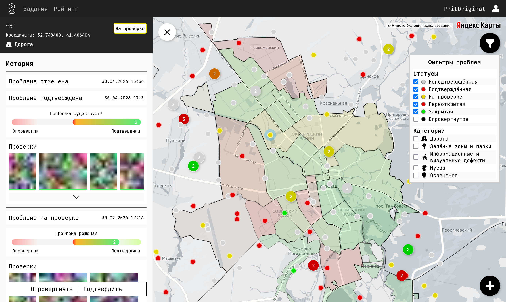
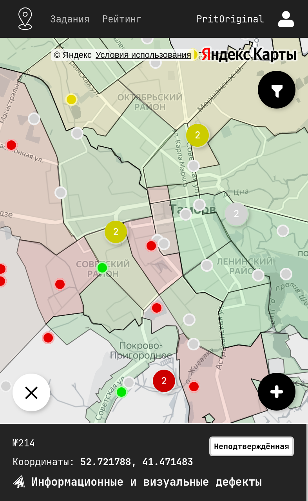
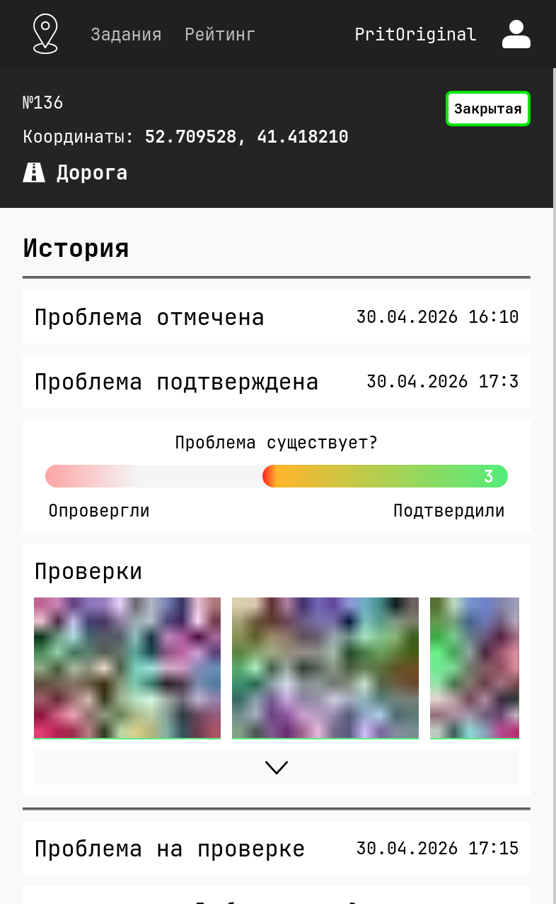

# problem-map-server

[](https://wakatime.com/badge/user/b2a0c08d-61f2-4144-ba78-aab13a59cb9f/project/62d78167-daec-4c9e-a232-ffef6036e9c7)

В даннои репозитории представлены наработки Golang REST API и gRPC серверов дипломной работы по теме "Разработка краудсорсинговой системы мониторинга городских проблем с оптимизацией процессов модерации".



<p>
  
  
</p>

## О проекте

[problem-map.pritoriginal.ru](https://problem-map.pritoriginal.ru/) - сайт, на котором можно посмотреть визуализацию.
`(Находится в активной разработке)`

[problem-map-react](https://github.com/PritOriginal/problem-map-react) - репозиторий фронта.

[Swagger документация](./docs/swagger.json) - доступна по адресу `http://[host]:[port]/swagger/index.html`

> [!NOTE]  
> Этот проект находится в процессе активной разработки. В настоящее время в нём реализовано не всё запланированное, поэтому не исключено наличие ошибок.

### Работа с геоданными

Для работы с геоданными и PostGIS были написаны структуры-обёртки для пакета [github.com/twpayne/go-geom](https://github.com/twpayne/go-geom).

А именно для пакетов [ewkb](https://github.com/twpayne/go-geom) и [geojson](github.com/twpayne/go-geom/encoding/geojson).

**Порядок координат в API.** Все геометрии хранятся в WGS84 (SRID 4326) в порядке GeoJSON/PostGIS: `X = longitude` (долгота), `Y = latitude` (широта). В `POST /marks` поля формы `longitude` и `latitude` передаются раздельно и в точку кладутся как `Point(longitude, latitude)`; клиенты не должны менять их местами. Для Тамбова: `longitude ≈ 41.4`, `latitude ≈ 52.7`.

### Стек

- [`Gin`](https://github.com/gin-gonic/gin) - Веб-фреймворк
- `PostgreSQL` - БД
- `PostGIS` - Для поддержки хранения геоданных
- [`migrate`](https://github.com/golang-migrate/migrate) - Миграции
- `Redis` - Кеширование
- [`go-transaction-manager`](https://github.com/avito-tech/go-transaction-manager) - Менеджер транзакций
- `S3` - Для хранения фото меток
- `Docker` - Контейнеризация
- `log/slog` - Логгер
- `GitHub Actions` - CI/CD  
- [`swaggo/swag`](https://github.com/swaggo/swag) - OpenAPI (Swagger)
- [`OpenStreetMap`](https://www.openstreetmap.org/) - Источник пространственных данных (административных границ)
- [`Overpass QL`](https://wiki.openstreetmap.org/wiki/Overpass_API/Overpass_QL) - Язык запросов для работы с данными OpenStreetMap
- [`osm2pgsql`](https://osm2pgsql.org/) - Инструмент для импорта данных OpenStreetMap

API:

- `REST` (Основа)
- `gRPC`

## Подготовка

### Для локального запуска

Создайте конфиг

Для `.yaml`

```bash
cp ./configs/config.yaml.example ./configs/config.yaml
```

Для `.env` (если предпочитаете переменные окружения)

```bash
cp ./configs/.env.example ./configs/.env
```

### Переменные окружения и секреты

Конфиг читается из файла, путь к которому передаётся флагом `--config=<path>`
или переменной `CONFIG_PATH`. Значения из файла можно переопределить
переменными окружения (имена указаны в `configs/.env.example`).

Локальные конфиги (`configs/config*.yaml`, `configs/.env*`) игнорируются git —
в репозитории лежат только шаблоны `config.yaml.example` / `.env.example`
и `.env.docker` для compose.

**JWT-ключи в шаблонах — плейсхолдеры.** При старте сервер проверяет, что
`JWT_ACCESS_TOKEN_KEY` / `JWT_REFRESH_TOKEN_KEY` не пустые и не короче
32 байт, а `POSTGRES_PASSWORD` задан; иначе запуск завершится с понятной ошибкой.
Сгенерируйте собственные ключи и подставьте их в конфиг:

```bash
openssl rand -base64 32   # JWT_ACCESS_TOKEN_KEY
openssl rand -base64 32   # JWT_REFRESH_TOKEN_KEY
```

Основные переменные:

| Переменная | Описание | По умолчанию |
|---|---|---|
| `JWT_ACCESS_TOKEN_KEY` / `JWT_REFRESH_TOKEN_KEY` | ключи подписи JWT (>= 32 байт) | — |
| `JWT_ACCESS_TOKEN_EXPIRED_IN` / `JWT_REFRESH_TOKEN_EXPIRED_IN` | время жизни токенов | — |
| `POSTGRES_HOST`, `POSTGRES_PORT`, `POSTGRES_USER`, `POSTGRES_PASSWORD`, `POSTGRES_DB` | подключение к PostgreSQL | — |
| `POSTGRES_SSLMODE` | `sslmode` для PostgreSQL | `disable` |
| `POSTGRES_MAX_OPEN_CONNS` / `POSTGRES_MAX_IDLE_CONNS` / `POSTGRES_CONN_MAX_LIFETIME` | пул соединений | `25` / `5` / `5m` |
| `REDIS_HOST`, `REDIS_PORT`, `REDIS_PASSWORD` | подключение к Redis | — |
| `AWS_KEY`, `AWS_SECRET_KEY`, `AWS_ENDPOINT` | S3-хранилище фото (при `PHOTO_STORAGE=s3`) | — |

В Docker конфиг не копируется в образ: `docker/*/compose.yaml` монтирует
`configs/.env.docker` в контейнер (`/etc/problem-map/.env`) и передаёт его же
через `env_file`.

## Запуск

### Запуск REST API сервера

```bash
make run-rest
```

Docker:

```bash
make docker-rest
```

### Запуск gRPC сервера

```bash
make run-grpc
```

Docker:

```bash
make docker-grpc
```

### Запуск tasker (раздача заданий на проверку)

`cmd/tasker` — фоновая задача, которая раздаёт пользователям задания на
проверку неподтверждённых меток. Каждый прогон делает два шага:

1. `ExpireOverdue` — все задания в статусе «Выдано» с истёкшим `due_at`
   переводятся в «Просрочено» одним `UPDATE`;
   тем же прогоном `SLA.ExpireOverdue` публикует `mark.sla_breached` для
   меток служб с истёкшим `sla_due_at` (см. «Городские службы и SLA»);
2. `Update` — для меток в статусах «Неподтверждённая» / «На проверке»
   подбираются исполнители и новые задания записываются одной транзакцией
   с `due_at = now + tasker.task-ttl`.

Режимы:

```bash
make run-tasker                                   # один прогон (--once)
go run ./cmd/tasker --config=configs/config.yaml  # по расписанию, tasker.interval
go run ./cmd/tasker --config=configs/config.yaml --interval 5m
```

В режиме расписания первый прогон выполняется сразу, дальше — по тикеру;
`SIGINT`/`SIGTERM` завершают процесс с кодом 0 (текущий запрос отменяется
через контекст). Неудачный прогон логируется, расписание продолжается.

Конфигурация (`tasker:` в YAML, переменные окружения `TASKER_*`):

| Параметр | Env | По умолчанию | Описание |
|---|---|---|---|
| `interval` | `TASKER_INTERVAL` | `15m` | период запусков |
| `task-ttl` | `TASKER_TASK_TTL` | `72h` | срок выполнения задания (`due_at`) |
| `max-tasks-per-user` | `TASKER_MAX_TASKS_PER_USER` | `3` | лимит одновременно выданных заданий на пользователя |
| `required-checks` | `TASKER_REQUIRED_CHECKS` | `2` | сколько независимых проверок нужно метке |
| `target-probability` | `TASKER_TARGET_PROBABILITY` | `0.8` | целевая вероятность получить `required-checks` проверок |
| `max-radius-meters` | `TASKER_MAX_RADIUS_METERS` | `5000` | радиус от дома пользователя до метки |
| `distance-lambda` | `TASKER_DISTANCE_LAMBDA` | `0.05` | затухание по расстоянию (на км) |
| `load-delta` | `TASKER_LOAD_DELTA` | `0.3` | штраф за каждое выданное задание |
| `fatigue-beta` | `TASKER_FATIGUE_BETA` | `0.2` | штраф за каждое просроченное задание |

Вероятность того, что пользователь проверит метку на расстоянии `d` км от
дома:

```
p = (rating(r) + distance(d)) · load(l) · fatigue(o),   p ≤ 1
rating(r)   = 0.2 / (1 + 100·e^(−r/2))        r — рейтинг пользователя
distance(d) = 0.5 · e^(−λ·d)                   λ = distance-lambda
load(l)     = 1 / (1 + δ·(l + 1))              l — выданных заданий, δ = load-delta
fatigue(o)  = 1 / (1 + β·o)                    o — просроченных заданий, β = fatigue-beta
```

Метка считается покрытой, когда вероятность того, что хотя бы
`required-checks` из её исполнителей выполнят проверку (распределение
Пуассона-биномиальное), достигает `target-probability`. Пока есть
непокрытые метки и свободные кандидаты, каждой такой метке за раунд
добавляется лучший по `p` пользователь; пара «пользователь–метка», по которой
уже есть задание в любом статусе, повторно не выдаётся (дополнительно
частичный уникальный индекс `tasks(user_id, mark_id) WHERE status_id = 1`
защищает от гонки двух одновременных прогонов).

### Push-уведомления (cmd/notifier)

`cmd/notifier` подписывается на доменные события в NATS
(`mark.status_changed`, `task.assigned`, `check.added`, `mark.assigned`,
`mark.sla_breached`, `mark.comment_added`), сохраняет
уведомление каждому адресату в `notifications` и отправляет push на его
устройства из `user_devices` (токены регистрирует клиент через
`POST /users/me/devices`, см. Swagger).

```bash
go run ./cmd/notifier --config=configs/config.yaml
```

Провайдеры (`internal/push`):

| Платформа | Провайдер | Состояние |
|---|---|---|
| `android`, `web` | Firebase Cloud Messaging, HTTP v1 (`internal/push/fcm`) | реализовано |
| `ios` | Apple Push Notification service (`internal/push/apns`) | заглушка: пуши только логируются, конфиг зарезервирован |

Без креденшелов FCM notifier стартует с предупреждением и только пишет в лог,
что было бы отправлено.

**Как получить service account для FCM:**

1. В [Firebase Console](https://console.firebase.google.com/) откройте проект
   → *Project settings* → *Service accounts* → *Generate new private key*.
   Скачается JSON-ключ (`type: service_account`, `project_id`, `client_email`,
   `private_key`).
2. Убедитесь, что в Google Cloud проекта включён *Firebase Cloud Messaging API
   (V1)*; сервисный аккаунт должен иметь роль *Firebase Cloud Messaging API
   Admin* (у сгенерированного в консоли ключа она есть).
3. Передайте ключ notifier'у одним из двух способов: путём к файлу
   (`push.fcm.credentials-file` / `FCM_CREDENTIALS_FILE`) или содержимым JSON
   в переменной окружения (`FCM_CREDENTIALS_JSON`, удобно для контейнеров).
   Ключ — секрет: не коммитьте его и не кладите в образ.

Notifier получает OAuth2-токен по JWT сервисного аккаунта (scope
`https://www.googleapis.com/auth/firebase.messaging`) и шлёт
`POST https://fcm.googleapis.com/v1/projects/{project}/messages:send` с
`notification{title, body}` и `data{type, mark_id, task_id, notification_id}`
(для `web` дополнительно секция `webpush`). Ответы 5xx/429 повторяются с
экспоненциальной задержкой (`Retry-After` учитывается), остальные 4xx — нет.
Токен, который FCM отверг как `UNREGISTERED` / `INVALID_ARGUMENT`,
удаляется из `user_devices`. Ошибка доставки не отменяет сохранённое
уведомление: она логируется и попадает в метрику
`push_sent_total{platform,result}` (`result` — `ok`, `invalid_token`,
`error`, `unsupported`), которую notifier отдаёт на
`http://:<notifier.metrics-port>/metrics`.

Конфигурация (`push:` / `notifier:` в YAML):

| Параметр | Env | По умолчанию | Описание |
|---|---|---|---|
| `push.send-timeout` | `PUSH_SEND_TIMEOUT` | `15s` | доставка одного уведомления на все устройства адресата, включая ретраи |
| `push.fcm.project-id` | `FCM_PROJECT_ID` | из ключа | id проекта Firebase |
| `push.fcm.credentials-file` | `FCM_CREDENTIALS_FILE` | — | путь к JSON-ключу сервисного аккаунта |
| `push.fcm.credentials-json` | `FCM_CREDENTIALS_JSON` | — | сам JSON-ключ (взаимоисключимо с файлом) |
| `push.fcm.timeout` | `FCM_TIMEOUT` | `5s` | таймаут одного HTTP-запроса |
| `push.fcm.max-retries` | `FCM_MAX_RETRIES` | `3` | повторов на 5xx/429 (0–3) |
| `push.fcm.concurrency` | `FCM_CONCURRENCY` | `8` | одновременных запросов к FCM |
| `push.apns.key-file` | `APNS_KEY_FILE` | — | `.p8`-ключ APNs (зарезервировано) |
| `push.apns.key-id` / `team-id` / `bundle-id` | `APNS_KEY_ID` / `APNS_TEAM_ID` / `APNS_BUNDLE_ID` | — | параметры APNs (зарезервировано) |
| `push.apns.sandbox` | `APNS_SANDBOX` | `false` | dev-окружение APNs |
| `notifier.metrics-port` | `NOTIFIER_METRICS_PORT` | `0` | порт `/metrics` notifier'а (0 — выключено) |
### События и доставка (notifier)

Серверы (REST/gRPC) и tasker публикуют доменные события в NATS, а
`cmd/notifier` превращает их в уведомления пользователям:

| Событие (subject) | Когда | Кому |
|---|---|---|
| `mark.status_changed` | метка сменила статус | автору метки |
| `task.assigned` | выдано задание на проверку | исполнителю |
| `check.added` | добавлена проверка метки | автору метки |
| `mark.comment_added` | добавлен комментарий к метке | автору метки, автору родительского комментария (для ответа) и подписчикам метки, без дублей и не самому автору комментария (тип уведомления `comment_added`) |

Запуск (нужны `db` и `nats.url`):

```bash
make run-notifier                                  # go run ./cmd/notifier --config=configs/config.yaml
docker compose -f docker/rest/compose.yaml --profile nats up   # nats -js + notifier
```

#### Гарантии доставки

По умолчанию (`nats.delivery: jetstream`) события идут через **JetStream** —
доставка **at-least-once**:

- При старте издатель и консьюмер идемпотентно создают стрим
  `PROBLEM_MAP_EVENTS` (subjects `mark.>`, `task.>`, `check.>`, retention
  *limits*, `max_age` 7 дней, файловое хранилище) и DLQ-стрим
  `PROBLEM_MAP_DLQ` (`dlq.>`, 30 дней). Retention *limits* вместо
  *work-queue* выбран сознательно: work-queue допускает лишь одного
  консьюмера на subject, удаляет событие сразу после ack (нечего переиграть
  для отладки или для нового консьюмера) и навсегда оставляет в стриме
  сообщение, исчерпавшее `MaxDeliver`. С *limits* каждый консьюмер ведёт
  свою позицию, событие доступно неделю, стрим чистится сам.
- `Publish` ждёт подтверждения сервера (PubAck); `event_id` события
  отправляется как `Nats-Msg-Id`, поэтому повторная публикация того же
  события в окне 2 минуты отбрасывается сервером (дедупликация).
- notifier читает через durable pull-consumer `notifier` (несколько
  инстансов делят поток). Сообщение подтверждается (`Ack`) только после
  успешной обработки; при ошибке — `Nak` с backoff `1s, 5s, 30s, 2m`
  (последний повторяется); если воркер упал, сервер передоставит сообщение
  через `AckWait` (40 s).
- После 5 неудачных попыток (`MaxDeliver`) либо сразу при неисправимой
  ошибке (нечитаемый payload, неизвестный subject, новая версия схемы,
  panic) сообщение копируется в `PROBLEM_MAP_DLQ` на subject
  `dlq.<исходный subject>` с заголовками `X-Original-Subject`,
  `X-Original-Stream`/`-Seq`, `X-Original-Msg-Id`, `X-Consumer`, `X-Deliveries`, `X-Error`
  и терминируется (`Term`). Если скопировать в DLQ не удалось, событие
  логируется целиком (`event may be lost`).
- Обработка идемпотентна: уведомление хранится с `UNIQUE(event_id,
  user_id)`, повторная доставка не создаёт дубликат.
- Graceful shutdown: по `SIGINT`/`SIGTERM` консьюмер перестаёт забирать
  новые сообщения, дообрабатывает текущее и отправляет ack, затем
  закрываются NATS и БД (всё в `shutdown-timeout`).

Если у сервера JetStream выключен (`nats-server` без `-js`), клиент пишет
warning и работает через core NATS (at-most-once: событие, опубликованное
пока notifier не подключён, теряется). То же поведение включается явно
`nats.delivery: core` / `NATS_DELIVERY=core`.

#### DLQ: просмотр и переигрывание

Через [`nats` CLI](https://github.com/nats-io/natscli):

```bash
nats stream info PROBLEM_MAP_DLQ                    # сколько сообщений в DLQ
nats stream view PROBLEM_MAP_DLQ                    # payload + заголовки (X-Error, X-Original-Subject)
nats stream get  PROBLEM_MAP_DLQ <seq> -j           # одно сообщение по sequence

# переиграть: опубликовать payload на исходный subject (новый Nats-Msg-Id,
# чтобы дедупликация не отбросила повтор), затем убрать копию из DLQ
nats pub mark.status_changed "$(nats stream get PROBLEM_MAP_DLQ <seq> --raw)" \
  -H "Nats-Msg-Id:$(uuidgen)"
nats stream rmm PROBLEM_MAP_DLQ <seq>

# если сломалась сама обработка и починили notifier — можно переиграть
# все события из основного стрима заново, сбросив позицию консьюмера:
nats consumer rm PROBLEM_MAP_EVENTS notifier        # notifier пересоздаст его при старте с DeliverAll
```

#### Метрики

notifier отдаёт Prometheus-метрики на `notifier.metrics-port`
(`NOTIFIER_METRICS_PORT`, `0` — выключено) по `/metrics`; REST и gRPC
серверы публикуют счётчики издателя в своём `/metrics`:

| Метрика | Метки | Описание |
|---|---|---|
| `events_published_total` | `subject`, `result` = `ok`/`duplicate`/`error` | опубликовано событий |
| `events_consumed_total` | `subject`, `result` = `ack`/`nak`/`dlq`/`error` (`ok`/`error` в core-режиме) | обработано событий |
| `events_redeliveries_total` | — | сообщений, доставленных повторно |

Конфигурация (`nats:` / `notifier:` в YAML):

| Параметр | Env | По умолчанию | Описание |
|---|---|---|---|
| `nats.url` | `NATS_URL` | пусто | адрес брокера; пусто — события не публикуются |
| `nats.name` | `NATS_NAME` | `problem-map` | имя соединения |
| `nats.delivery` | `NATS_DELIVERY` | `jetstream` | `jetstream` (at-least-once) или `core` (at-most-once) |
| `notifier.metrics-port` | `NOTIFIER_METRICS_PORT` | `0` | порт `/metrics` воркера |

## Аутентификация

Сервер выдаёт пару JWT (HS256): **access** (`typ=access`) для заголовка
`Authorization: Bearer …` и **refresh** (`typ=refresh`, уникальный `jti`) для
`POST /auth/tokens/refresh`. Токены не взаимозаменяемы: refresh-токен не
проходит auth-middleware (REST и gRPC), access-токен не принимается на
refresh/logout. Оба несут `role` и `ver` (версию авторизации пользователя).

Состояние сессий хранится в Redis (миграций БД нет):

| Ключ | Значение | TTL |
|---|---|---|
| `refresh:<user_id>:<jti>` | активный refresh-токен | срок жизни refresh |
| `refresh:<user_id>` | SET активных `jti` пользователя (индекс для `logout-all`, без `SCAN`) | срок жизни последнего выданного refresh |
| `user:<user_id>:auth_version` | текущая версия авторизации (`ver`) | — |

Все операции с refresh-токенами — Lua-скрипты, т.е. атомарны: проверка и
удаление `jti` при ротации — один `DEL` внутри скрипта, поэтому из двух
параллельных refresh с одним токеном новую пару получает только один.

Эндпоинты:

| Метод | Путь | Доступ | Действие |
|---|---|---|---|
| `POST` | `/auth/signin` | — | выдаёт пару токенов, регистрирует `jti` |
| `POST` | `/auth/tokens/refresh` | — | **одноразовая ротация**: старый `jti` удаляется, выдаётся новая пара. Повторное предъявление уже использованного (или отозванного) refresh-токена трактуется как кража: `401` и отзыв всех refresh-токенов пользователя |
| `POST` | `/auth/logout` | JWT | отзывает переданный в теле refresh-токен (`{"refresh_token": …}`), access-токен живёт до `exp` |
| `POST` | `/auth/logout-all` | JWT | отзывает все refresh-токены и инкрементит `auth_version` — все access-токены сразу становятся недействительными |
| `POST` | `/users/me/password` | JWT | смена пароля (`{"old_password", "new_password"}`, новый ≥ 8 символов, bcrypt cost 12); неверный старый пароль — `403`; все сессии сбрасываются |
| `PATCH` | `/users/{id}/role` | admin | смена роли (`{"role": "user"|"moderator"|"admin"}`); сессии пользователя сбрасываются, новая роль действует сразу. Последний admin не может снять роль admin с самого себя (`403`) |

**Отзыв при повторном использовании — осознанный DoS-вектор.** Если старый
(уже использованный) refresh-токен утёк, злоумышленник может предъявлять
его и каждый раз разлогинивать все устройства жертвы. Это принято как
плата за детекцию кражи: доступ к аккаунту при этом не получить, а
пользователь замечает проблему по внезапным выходам.

Актуальность роли: auth-middleware сравнивает `ver` из токена с
`user:<id>:auth_version` в Redis (значение кэшируется в памяти процесса на
5 с), при расхождении — `401`. Ротация refresh-токена тоже проверяет `ver`.
Так смена роли, пароля и `logout-all` вступают в силу не дожидаясь
истечения access-токена: на инстансе, обработавшем отзыв, кэш сбрасывается
сразу, на остальных — с задержкой до 5 с.

Политика версий: отсутствие ключа `auth_version` означает версию `0`;
если ключ есть — `ver` токена должен совпадать с ним точно. Токены,
выданные с `ver=0` пользователю, чья версия уже ≥ 1 (см. fail-open ниже),
отвергаются.

gRPC-интерцептор применяет те же проверки, что и REST-middleware (общий
код в `internal/auth`): подпись, `exp`, `typ=access` и `ver` против Redis с
тем же 5-секундным кэшем; отозванный или refresh-токен в `authorization`
отвергается с `Unauthenticated`. gRPC-сервер подключается к тому же Redis
(секция `redis:`), без него проверка `ver` пропускается (fail-open, warn в
логе), а Redis отражается в gRPC health как optional-зависимость.

**Redis недоступен — fail-open.** Как и кэш с rate-limit'ом, все проверки
сессий деградируют мягко: REST и gRPC стартуют без Redis (в лог пишется
error, `readyz` показывает `redis: error`), клиент переподключается
сам. Пока Redis недоступен:

- вход и ротация работают, но `jti` не сохраняется/не проверяется
  (защита от повторного использования refresh-токена не действует);
- проверка `ver` пропускается с предупреждением в логе; токены выдаются с
  `ver=0`;
- `logout`/`logout-all`/смена пароля и роли не могут отозвать токены — в
  лог пишется warn.

После восстановления Redis токены, выданные во время простоя, отвергаются
(пользователю нужно войти заново): refresh-токены не найдутся в хранилище,
а `ver=0` не совпадёт с хранимой версией у всех, кто хоть раз отзывал
сессии. У пользователей без ключа `auth_version` (версия `0`) такие токены
продолжают работать.
### Рейтинг и антифрод

Рейтинг пользователя (`users.rating`, его читает tasker) меняется только
через журнал `rating_events` — каждое начисление записывается вместе с
причиной, меткой и проверкой, а `users.rating` обновляется тем же запросом.

Начисления (секция `rating:` в YAML, переменные `RATING_*`):

| Параметр | Env | По умолчанию | Когда |
|---|---|---|---|
| `check-correct` | `RATING_CHECK_CORRECT` | `2` | голос проверяющего совпал с итогом этапа |
| `check-wrong` | `RATING_CHECK_WRONG` | `-1` | голос проверяющего не совпал с итогом |
| `mark-confirmed` | `RATING_MARK_CONFIRMED` | `3` | автору — метка подтверждена (`Неподтверждённая → Подтверждена`) |
| `mark-refuted` | `RATING_MARK_REFUTED` | `-2` | автору — метка опровергнута (`Неподтверждённая → Опровергнута`) |
| `task-completed` | `RATING_TASK_COMPLETED` | `1` | проверка закрыла выданное задание |
| `max-checks-per-day` | `RATING_MAX_CHECKS_PER_DAY` | `50` | лимит проверок на пользователя за скользящие 24 часа |

Этап голосования закрывается, когда сумма голосов (`±1`) по текущему
элементу `mark_status_history` достигает `±3` — или решением модератора
(`POST /marks/{id}/confirm|reject`). Начисления и смена статуса пишутся в
одной транзакции.

Антифрод в `POST /checks`: автор не может проверять свою метку (`403`),
одна проверка на этап (`409`), не больше `max-checks-per-day` проверок в
сутки (`429`).

Эндпоинты:

- `GET /users/{id}/stats`, `GET /users/me/stats` — `{rating, marks_total, marks_confirmed, marks_refuted, checks_total, checks_correct, tasks_completed}`;
- `GET /leaderboard?limit=&offset=` — `{user_id, username, rating}` по убыванию рейтинга;
- `GET /users/{id}/rating-events?limit=&offset=` — журнал начислений (владельцу и модератору).

## Часовые пояса

Все временные метки (`created_at`, `updated_at`, `changed_at`, `due_at`, …) хранятся в PostgreSQL как `TIMESTAMPTZ`, то есть как момент времени, а не как «настенные» часы. Миграция `000036_timestamptz` переводит старые колонки `TIMESTAMP` в `TIMESTAMPTZ`, интерпретируя прежние значения как UTC (`USING col AT TIME ZONE 'UTC'`) — сами моменты при этом не сдвигаются.

- Сервер подключается к БД с `timezone=UTC` (параметр добавляется в DSN автоматически, см. `config.DatabaseConfig.DSN()`), поэтому `date_trunc` в аналитике и текстовое представление дат не зависят от настроек сервера PostgreSQL.
- Клиент может передавать время с любым смещением (`2026-03-10T14:30:15+05:00`) — в БД оно сравнивается и сохраняется как момент; в ответах API время отдаётся в RFC 3339 с UTC-смещением.
- В SQL не нужны приведения `::timestamp`: параметры `time.Time` связываются как `timestamptz`.

## Локализация

Справочники (`GET /marks/types`, `GET /marks/statuses`, `GET /tasks/statuses`) отдают элементы вида `{id, code, name}`:

- `id` — числовой идентификатор; для совместимости со старыми клиентами он дублируется в устаревших полях `mark_type_id` / `mark_status_id` (deprecated, будут удалены).
- `code` — стабильный машиночитаемый идентификатор латиницей (`garbage`, `lighting`, `unconfirmed`, `under_review`, `issued`, …); на него стоит опираться в клиентской логике.
- `name` — локализованное название. Язык выбирается по заголовку `Accept-Language` (поддерживаются `ru` и `en`, по умолчанию `ru`; региональные суффиксы вроде `en-US` и q-веса учитываются). Если перевода нет, возвращается русское название. В gRPC язык передаётся в metadata `accept-language`.

Переводы хранятся в таблице `translations(entity, entity_id, lang, name)` (миграция `000037_add_i18n`); чтобы добавить язык, достаточно вставить строки с новым `lang`. Новый элемент справочника добавляется вставкой строки с обязательным уникальным `code` и его переводов в `translations` (пример — `internal/repository/postgres/insert.sql`); миграция назначает коды по русским названиям, дубликатам названий добавляет суффикс `_<id>`, неизвестным — синтетический код `type_<id>` / `status_<id>`. Ответ помечается заголовками `Content-Language` и `Vary: Accept-Language`, а кэш справочников ведётся отдельно для каждого языка.

Сообщения об ошибках API (`message` в ответе) не переводятся — они английские и предназначены для машинной обработки.
### Городские службы и SLA

Организации (`organizations`) — исполнители: службы, которые устраняют
подтверждённые проблемы. У организации есть участники
(`organization_members`, у пользователя роль `service`) и зоны
ответственности (`organization_responsibilities`: тип метки + граница
`admin_boundaries`).

Жизненный цикл метки со службой:

1. При переходе в «Подтверждённая» (голосование или `POST /marks/{id}/confirm`)
   в той же транзакции ищется организация по `mark_type_id` и
   `ST_Contains(boundary.geom, mark.geom)`; при нескольких совпадениях
   побеждает самая локальная граница (наибольший `admin_level`). Метке
   проставляются `organization_id` и `sla_due_at = now + types_marks.sla_hours`
   (по умолчанию 72 ч), после коммита публикуется `mark.assigned` —
   уведомление получают все участники службы.
2. `POST /marks/{id}/start` (участник назначенной службы или `admin`) —
   «Подтверждённая → В работе» (статус `7`).
3. `POST /marks/{id}/resolve` (multipart `comment`, `photos[]`) —
   «В работе → На проверке»; отчёт сохраняется как проверка от имени
   сотрудника на этапе «В работе»: он не участвует в голосовании этапа
   проверки и не начисляет рейтинг (рейтинг получают только проверки
   разрешаемого этапа голосования). Участники назначенной службы не могут
   голосовать по этой метке (`POST /checks` → 403). Далее — обычное
   голосование жителей.
4. `PATCH /marks/{id}/assign {organization_id}` — ручное переназначение
   модератором/админом, срок SLA сбрасывается (метка «В работе» статус
   сохраняет). Если ответственной службы не нашлось, метка остаётся без
   организации и без SLA до ручного назначения. Метка подтверждается один
   раз («Обнаружена повторно» разрешается сразу в «На проверке»), поэтому
   организация у неё сохраняется, а SLA заново не запускается.

`is_overdue` в JSON метки вычисляется на чтении: `sla_due_at < now` при
статусе «Подтверждённая» / «В работе». Tasker публикует `mark.sla_breached`
один раз на нарушение: после успешной публикации метка помечается
`sla_breached_at` и не попадает в выборку до сброса срока переназначением;
неопубликованное (NATS недоступен) событие повторяется на следующем прогоне.
`event_id = uuid5(mark_id, sla_due_at)` детерминирован, так что повтор не
плодит уведомлений (`UNIQUE (event_id, user_id)`).

Эндпоинта удаления организации нет; при удалении строки вручную участники
каскадно теряют членство, но сохраняют роль `service` (снять — через
`DELETE .../members/{user_id}` до удаления).

Эндпоинты:

- `GET /organizations` — публичный список `{id, name}`;
- `GET /organizations/me` — своя организация с участниками и зонами (`service`, `admin`);
- `GET /organizations/{id}/marks?status_ids=&overdue=&limit=&offset=` — очередь службы: просроченные → ближайший `sla_due_at` (участники и `admin`);
- `POST /organizations`, `PATCH /organizations/{id}`, `GET /organizations/{id}` — администрирование (`admin`);
- `POST /organizations/{id}/members {user_id}`, `DELETE /organizations/{id}/members/{user_id}` — участники (роль `service` ставится/снимается, сессии пользователя отзываются);
- `POST|DELETE /organizations/{id}/responsibilities {mark_type_id, boundary_id}` — зоны ответственности;
- `GET /analytics/kpi` дополнительно возвращает `sla_breach_share` (доля просроченных среди назначенных) и `by_organization[{organization_id, name, total, overdue}]`.
## Комментарии к меткам

- `GET /marks/{id}/comments?limit&offset` — публично; с Bearer-токеном в
  каждом комментарии заполняется `is_mine`. Удалённые комментарии
  возвращаются с `deleted=true` и пустым `body`, чтобы ответы (`parent_id`)
  не осиротели. У метки есть `comments_count` (только не удалённые).
- `POST /marks/{id}/comments {body, parent_id?}` — JWT; `parent_id`
  указывает на комментарий верхнего уровня той же метки (один уровень
  ответов). Тело обрезается по пробелам, пустое отклоняется (400), длина —
  до 2000 символов. Антиспам: тот же текст от того же пользователя на ту же
  метку в течение минуты — 409; больше `comments.max-per-day` (по умолчанию
  100) комментариев за скользящие сутки — 429.
- `PATCH /comments/{id} {body}` — только владелец и только в течение
  `comments.edit-window` (15 минут) после создания, иначе 409.
- `DELETE /comments/{id}` — владелец, `moderator` или `admin`; мягкое
  удаление (`deleted_at`).

## Экспорт

`GET /marks/export?format=geojson|csv` отдаёт все метки, подходящие под те же
фильтры, что и `GET /marks` (`bbox`, `mark_type_ids`, `mark_status_ids`,
`user_id`, `created_from`, `created_to`, `sort`, `order`), одним файлом без
пагинации. Ответ стримится построчно (`json.Encoder` по фиче /
`csv.Writer` по строке поверх курсора БД), поэтому память сервера не зависит от
размера выборки.

| Формат | `Content-Type` | Содержимое |
|---|---|---|
| `geojson` | `application/geo+json` | `FeatureCollection`; каждая `Feature` — `Point` (lon, lat) и `properties` `{mark_id, description, mark_type_id, mark_status_id, user_id, followers_count, created_at, updated_at}` |
| `csv` | `text/csv; charset=utf-8` | UTF-8 с BOM (для Excel), CRLF; колонки `mark_id, longitude, latitude, description, mark_type_id, mark_status_id, user_id, followers_count, created_at, updated_at` |

Заголовок `Content-Disposition: attachment; filename="marks-<UTC-время>.geojson|csv"`.

Ограничения (секция `export:` в YAML, переменные `EXPORT_*`):

| Параметр | Env | По умолчанию | Что делает |
|---|---|---|---|
| `max-rows` | `EXPORT_MAX_ROWS` | `50000` | максимум строк в одном экспорте; если фильтрам соответствует больше — `400 "too many rows to export, narrow the filters"` (до отправки заголовков) |
| `rate-limit.requests` / `.window` | `EXPORT_RATE_LIMIT_REQUESTS` / `_WINDOW` | `2` / `1m` | лимит запросов экспорта на IP (тот же Redis-лимитер, что и у `/auth`; без Redis не ограничивает), при превышении `429` + `Retry-After` |

`GET /map/admin-boundaries/{id}.geojson` — одна административная граница как
GeoJSON `Feature` с `MultiPolygon`-геометрией и `properties {name, admin_level}`
(`application/geo+json`, кэшируется клиентом на сутки).

```bash
curl -o marks.geojson 'http://localhost:3333/marks/export?format=geojson&bbox=41.3,52.6,41.6,52.8&mark_status_ids=2'
curl -o marks.csv     'http://localhost:3333/marks/export?format=csv&created_from=2026-01-01T00:00:00Z'
curl -o center.geojson 'http://localhost:3333/map/admin-boundaries/1.geojson'
```

Экспорт большого файла должен уложиться в `rest.timeout.write`; при
необходимости увеличьте его или сузьте фильтры.

## Вебхуки

Вебхук — HTTPS-подписка на доменные события (`mark.*`, `task.*`, `check.*`),
которые сервисы публикуют в NATS (см. `internal/events`). Доставку выполняет
`cmd/notifier`: отдельный durable-консьюмер `webhooks` того же JetStream-стрима
`PROBLEM_MAP_EVENTS` (в core-режиме — queue-группа `webhooks`) читает
`mark.>`, `task.>`, `check.>`, поэтому каждое событие и превращается в
уведомление, и уходит в вебхуки ровно один раз; неудачная обработка
повторяется по общим правилам JetStream (см. «Гарантии доставки»). Управлять вебхуками могут пользователи с
ролью `moderator` или `admin` (владелец видит и правит только свои, `admin` —
любые).

| Метод | Путь | Что делает |
|---|---|---|
| `POST` | `/webhooks` | создать: `{url (только https), events[], secret?}`; `secret` генерируется, если не передан, и **возвращается один раз** в ответе (`payload.secret`) |
| `GET` | `/webhooks` | свои вебхуки (без секретов) |
| `PATCH` | `/webhooks/{id}` | `{active?, events?}` — включить/выключить, сменить события |
| `DELETE` | `/webhooks/{id}` | удалить вместе с журналом доставок |
| `GET` | `/webhooks/{id}/deliveries?limit&offset` | журнал доставок: `attempt`, `status_code`, `error`, `delivered_at`, `next_attempt_at`, `payload` |
| `POST` | `/webhooks/{id}/test` | отправить событие `webhook.test` один раз (без ретраев) и вернуть результат; работает и для выключенного вебхука |

`events` — точные темы (`mark.status_changed`, `task.assigned`,
`check.added`), маски по домену (`mark.*`) или `*`.

### Формат доставки

`POST <url>` с телом:

```json
{
  "event_id": "5e6b1d2c-…",
  "subject": "mark.status_changed",
  "occurred_at": "2026-08-29T10:15:00Z",
  "data": {"v": 1, "event_id": "5e6b1d2c-…", "mark_id": 42, "old_status": 1, "new_status": 2, "author_id": 7}
}
```

`data` — событие в том виде, в каком оно опубликовано в NATS. Заголовки:

| Заголовок | Значение |
|---|---|
| `Content-Type` | `application/json` |
| `X-Webhook-Id` | id вебхука |
| `X-Event-Id` | `event_id` — используйте для дедупликации: при ретраях тело и id не меняются |
| `X-Timestamp` | unix-время отправки (секунды); входит в подпись |
| `X-Signature` | `sha256=<hex HMAC-SHA256(secret, "<X-Timestamp>." + body)>` — HMAC считается от значения `X-Timestamp`, точки и **байтов тела как есть** |

Защита от replay: `X-Timestamp` подписан, поэтому приёмник должен отклонять
доставки, чей `X-Timestamp` отличается от текущего времени больше чем на
допустимое окно (рекомендуется 5 минут), и дедуплицировать по `X-Event-Id`
— при ретраях тело и `event_id` не меняются, а `X-Timestamp` и подпись
пересчитываются на каждую попытку.

Приёмник должен ответить `2xx` в течение `webhooks.timeout` (10 с);
редиректы не выполняются (3xx — ошибка). Любой другой ответ или сетевая
ошибка — неудачная попытка. Ретраи планирует тикер notifier'а
(`webhooks.retry-interval`) по `webhook_deliveries.next_attempt_at`
с задержками **1 мин → 5 мин → 30 мин → 2 ч → 12 ч**; если и шестая
попытка не удалась, вебхук переводится в `active=false`, а владельцу
создаётся уведомление `webhook.disabled`. Тестовые события не ретраятся.

Защита от SSRF: URL должен быть `https`, без учётных данных; хост
резолвится и при создании, и перед каждой отправкой — loopback, приватные
(RFC 1918/ULA), link-local (в том числе `169.254.169.254`), CGNAT и прочие
незамаршрутизируемые адреса отклоняются, соединение устанавливается только
на проверенные IP. `webhooks.allow-private-urls: true` отключает проверку
адресов **только для локальной разработки**.

Журнал доставок (`webhook_deliveries`) хранится 30 дней: notifier раз в
час удаляет записи старше. Тело события (`data`) ограничено 256 КБ —
события больше не доставляются (пишутся в лог с ошибкой).

Настройки (секция `webhooks:` в YAML, переменные `WEBHOOKS_*`): `timeout`
(`10s`), `retry-interval` (`30s`), `retry-batch` (`100`),
`allow-private-urls` (`false`).

### Проверка подписи

Go:

```go
const maxSkew = 5 * time.Minute

func verify(secret, timestamp string, body []byte, signature string) bool {
	ts, err := strconv.ParseInt(timestamp, 10, 64)
	if err != nil || time.Since(time.Unix(ts, 0)).Abs() > maxSkew {
		return false // отсутствующая, битая или устаревшая метка времени (replay)
	}
	const prefix = "sha256="
	if !strings.HasPrefix(signature, prefix) {
		return false
	}
	want, err := hex.DecodeString(strings.TrimPrefix(signature, prefix))
	if err != nil {
		return false
	}
	mac := hmac.New(sha256.New, []byte(secret))
	mac.Write([]byte(timestamp + "."))
	mac.Write(body)
	return hmac.Equal(mac.Sum(nil), want) // сравнение за константное время
}

// в хендлере:
body, _ := io.ReadAll(io.LimitReader(r.Body, 1<<20))
if !verify(os.Getenv("WEBHOOK_SECRET"), r.Header.Get("X-Timestamp"), body, r.Header.Get("X-Signature")) {
	http.Error(w, "bad signature", http.StatusUnauthorized)
	return
}
```

Python:

```python
import hashlib, hmac, time

MAX_SKEW = 300  # секунд

def verify(secret: str, timestamp: str, body: bytes, signature: str) -> bool:
    if not timestamp.isdigit() or abs(time.time() - int(timestamp)) > MAX_SKEW:
        return False  # устаревшая метка времени (replay)
    if not signature.startswith("sha256="):
        return False
    expected = hmac.new(secret.encode(), timestamp.encode() + b"." + body, hashlib.sha256).hexdigest()
    return hmac.compare_digest(signature[len("sha256="):], expected)  # константное время

# Flask:
# if not verify(SECRET, request.headers.get("X-Timestamp", ""), request.get_data(), request.headers.get("X-Signature", "")):
#     abort(401)
```

Та же функция есть в сервере: `webhooks.VerifySignature` в
`internal/webhooks`.

## Тесты

### Unit-тесты

Простой прогон тестов:

```bash
make test
```

Прогон тестов с выводом покрытия:

```bash
make test-cover
```

### Функциональные тесты

Запуск функциональных тестов

Для REST:

```bash
make test-functional-rest
```

Для gRPC (`В РАЗРАБОТКЕ`):

```bash
make test-functional-grpc
```

> [!NOTE]  
> Перед запуском функциональных тестов убедитесь, что тестируемый сервис запущен.

## Миграции

`migrate create`:

```bash
make migrate NAME_MIGRATION="name_migration" 
```

`migrate up`:

```bash
make migrate-up
```

`migrate down`:

```bash
make migrate-down-1
```

`migrate drop`:

```bash
make migrate-drop
```

`migrate version`:

```bash
make migrate-version
```

`migrate force`:

```bash
make migrate-force MIGRATION_VERSION=<migration-version> 
```

## Примечание

Если в качестве конфигурационного файла был выбран `.env`, то замените путь к конфигурационному файлу в `Makefile` либо запускайте приложение командой:

Для REST API:

```bash
go run ./cmd/rest/ --config=./configs/.env
```

Для gRPC:

```bash
go run ./cmd/grpc/ --config=./configs/.env
```
